# 使用AndroidStudio编辑Cocos项目

接下来详细介绍一下如何使用Android Studio打开以及编辑cocos2d-x 3.10项目：

### 一,新建项目：

&emsp;&emsp;新建源代码项目，预编译库项目不支持使用Android Stduio打开，见图1：

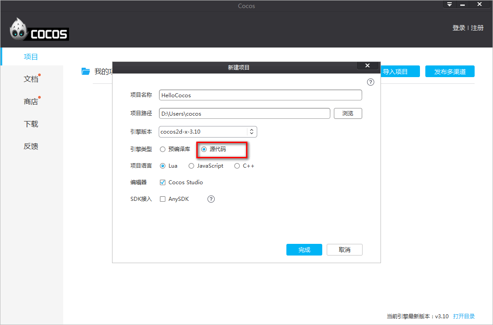

&emsp;&emsp;&emsp;&emsp;&emsp;&emsp;&emsp;&emsp;&emsp;&emsp;&emsp;&emsp;&emsp;&emsp;&emsp;&emsp;&emsp;&emsp;图1：新建项目。

### 二,Android Studio下载与安装：
&emsp;&emsp;1）项目成功创建，如果未安装Android Studio，“Android Studio打开”图标禁用，点击“Android Studio打开”，弹出提示对话框，见图2：

&emsp;&emsp;&emsp;&emsp;&emsp;&emsp;&emsp;&emsp;&emsp;&emsp;&emsp;&emsp;&emsp;&emsp;&emsp;&emsp;图2：未安装Android Studio提示窗口。

&emsp;&emsp;2）点击“前往下载”，打开“ [Android Studio官网](http://developer.android.com/sdk/index.html "Android Studio官网")（**国内用户需要翻墙**）”，下载Android Studio，见图3：

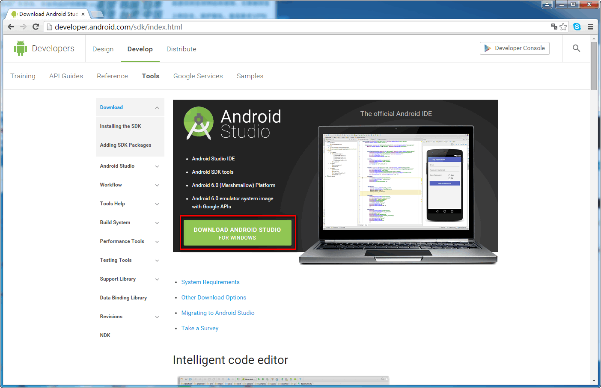
&emsp;&emsp;&emsp;&emsp;&emsp;&emsp;&emsp;&emsp;&emsp;&emsp;&emsp;&emsp;&emsp;&emsp;&emsp;&emsp;&emsp;&emsp;图3：下载Android Studio。

&emsp;&emsp;3）下载完成后，双击Andoid Studio安装包，打开 “Android Studio安装界面（见图4）”，点击“Next >”：

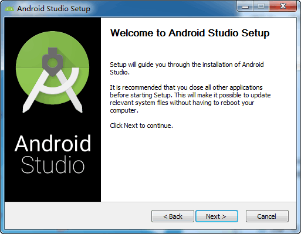
&emsp;&emsp;&emsp;&emsp;&emsp;&emsp;&emsp;&emsp;&emsp;&emsp;&emsp;&emsp;图4：Android Studio安装界面。

&emsp;&emsp;4）打开Android Studio组件自定义安装界面（见图5），全部勾选，点击“Next >”：

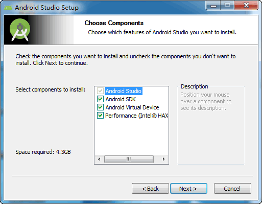

&emsp;&emsp;&emsp;&emsp;&emsp;&emsp;&emsp;&emsp;&emsp;&emsp;图5：Android Studio组件自定义安装界面。

&emsp;&emsp;5）打开Android Studio以及SDK安装目录选择界面（见图6），SDK目录记好后面会用到，点击“Next >”，开始进行安装：

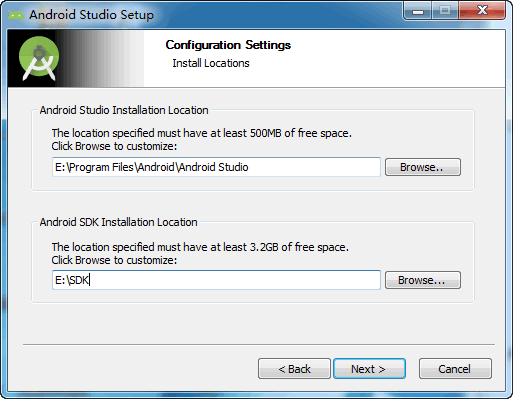

&emsp;&emsp;&emsp;&emsp;&emsp;&emsp;&emsp;&emsp;&emsp;&emsp;图6：Android Studio以及SDK安装目录选择界面。

&emsp;&emsp;6）安装完成显示完成界面（见图7）：

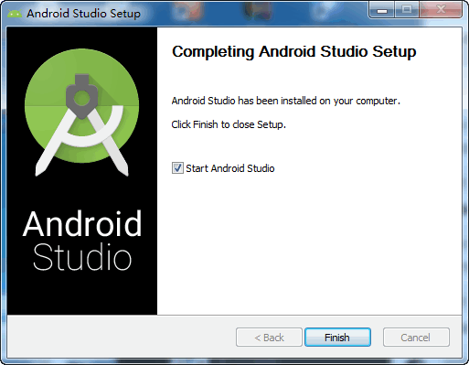

&emsp;&emsp;&emsp;&emsp;&emsp;&emsp;&emsp;&emsp;&emsp;&emsp;图7：Android Studio安装完成界面。

### 三,Android Studio打开项目：

&emsp;&emsp;1）安装完成后，需要添加Android 5.1.1（API 22）SDK Platform 以及 Build-tools 22.0.1，打开SDK的安装目录，双击打开“SDK Manager.exe”，见图8：

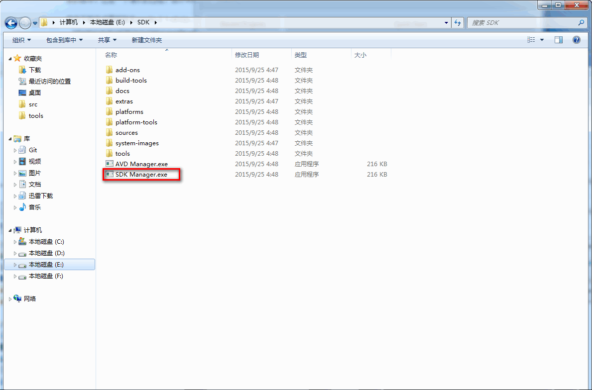

&emsp;&emsp;&emsp;&emsp;&emsp;&emsp;&emsp;&emsp;&emsp;&emsp;&emsp;&emsp;&emsp;&emsp;&emsp;&emsp;&emsp;&emsp;&emsp;&emsp;&emsp;&emsp;图8：打开SDK Manager.exe。

&emsp;&emsp;2）选择 Android 5.1.1（API 22）SDK Platform 以及 Android SDK Build-tools 22.0.1，然后“Install packagers...（**国内用户需要翻墙**）“，见图9：

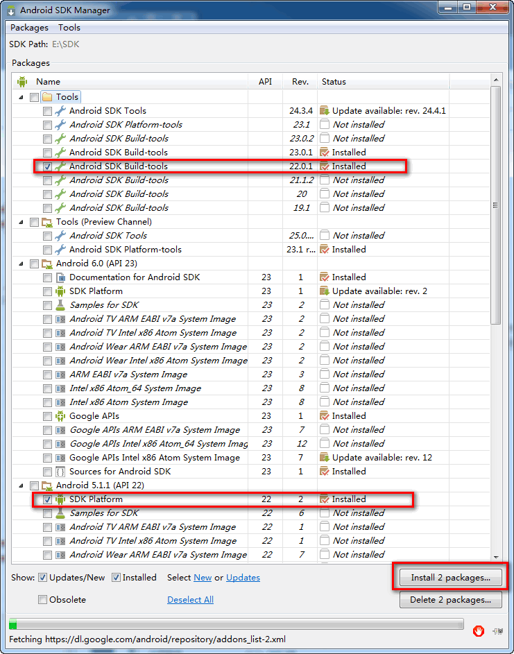

&emsp;&emsp;&emsp;&emsp;&emsp;&emsp;图9：安装 Android 5.1.1（API 22）SDK Platform 以及 Android SDK Build-tools 22.0.1。

&emsp;&emsp;3）重启 Cocos，“Android Studio打开”启用，见图10：

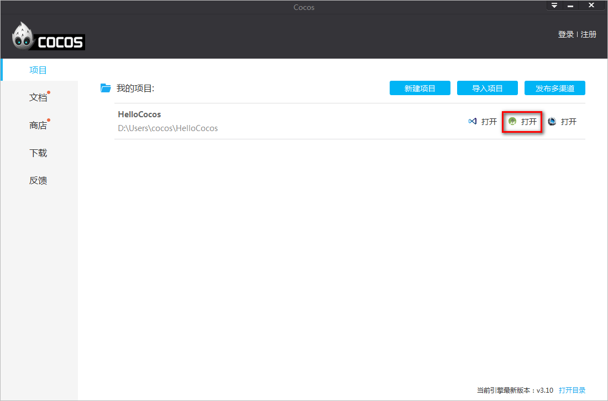

&emsp;&emsp;&emsp;&emsp;&emsp;&emsp;&emsp;&emsp;&emsp;&emsp;&emsp;&emsp;&emsp;&emsp;&emsp;&emsp;&emsp;&emsp;&emsp;&emsp;&emsp;&emsp;图10：“Android Studio打开”启用。

&emsp;&emsp;4）点击“Android Studio打开”，提示“Import Project from Gradle”，点击“OK”，开始下载并配置 Gradle（**国内用户需要翻墙**），见图11：

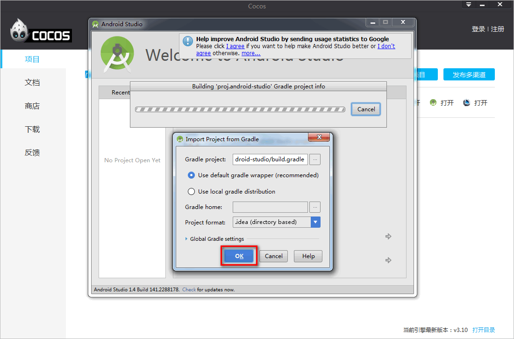

&emsp;&emsp;&emsp;&emsp;&emsp;&emsp;&emsp;&emsp;&emsp;&emsp;&emsp;&emsp;&emsp;&emsp;&emsp;&emsp;&emsp;&emsp;&emsp;&emsp;&emsp;&emsp;图11：Import Project from Gradle

&emsp;&emsp;5）“Import Project from Gradle”完毕之后，成功打开项目，见图12：

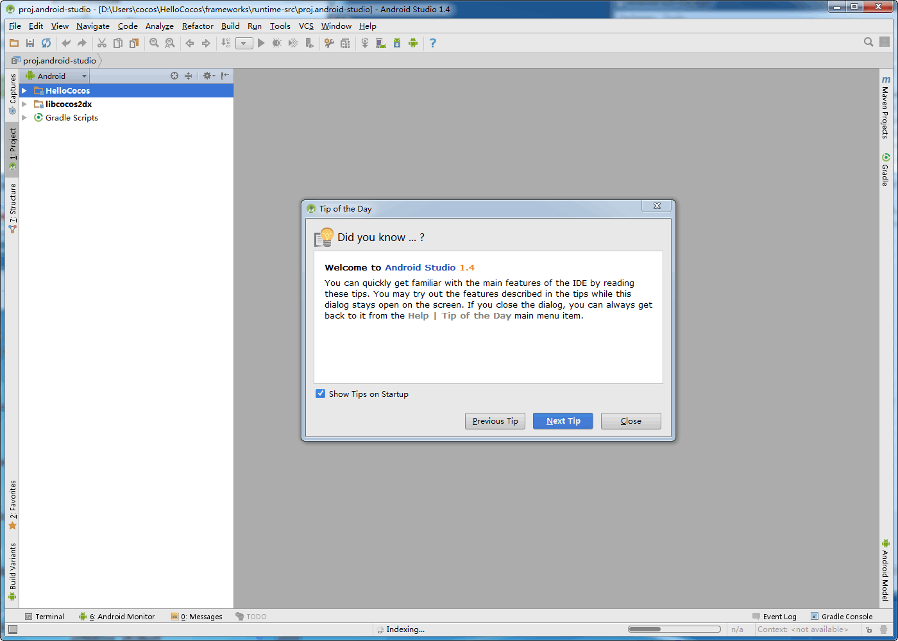

&emsp;&emsp;&emsp;&emsp;&emsp;&emsp;&emsp;&emsp;&emsp;&emsp;&emsp;&emsp;&emsp;&emsp;&emsp;&emsp;&emsp;&emsp;&emsp;&emsp;&emsp;&emsp;图12：成功打开项目

### 四,使用Android Studio调试Cocos项目

&emsp;&emsp;Android手机通过数据线与主机相连，点击菜单 Run -> Debug '项目名称'，弹出“Device Chooser”，见图13：

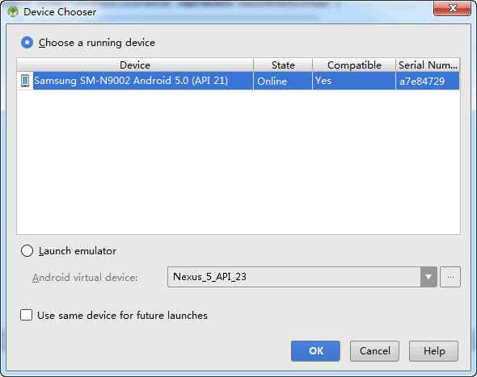

&emsp;&emsp;&emsp;&emsp;&emsp;&emsp;&emsp;&emsp;&emsp;&emsp;&emsp;&emsp;&emsp;&emsp;&emsp;&emsp;&emsp;&emsp;&emsp;&emsp;&emsp;&emsp;图13：Device Chooser。

&emsp;&emsp;Choose a running device: Debug项目在连接到主机的手机设备。

&emsp;&emsp;Launcher emulator: Debug项目在模拟器。

&emsp;&emsp;选择好调试的设备，点击 “OK”，可以开始调试了。

### 五,使用Android Studio生成APK：

&emsp;&emsp;1）调试好程序之后，点击菜单：“Build” -> “Generate Signed APK”，弹出设置签名对话框，见图14：

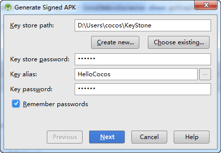

&emsp;&emsp;&emsp;&emsp;&emsp;&emsp;&emsp;&emsp;&emsp;图14：Generate Signed APK窗口。

&emsp;&emsp;Create new...：创建新的 Key store。

&emsp;&emsp;Choose existing...：选择已经存在的 Key store。

&emsp;&emsp;2）设置完Key store之后，点击“Next”，打开“生成目录设置以及Build类型”窗口，见图15：

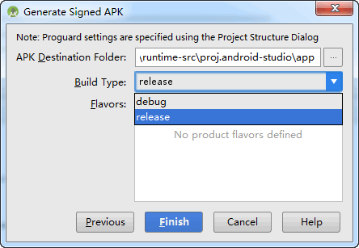

&emsp;&emsp;&emsp;图15：生成目录设置以及Build类型

&emsp;&emsp;&emsp;APK Destination Folder：APK生成目录。

&emsp;&emsp;&emsp;Build Type：Build类型，分为debug或者release。

&emsp;&emsp;&emsp;Flavors：Product flavors 主要用来定制APK的flavors，常用来进行多渠道的定义，方便多渠道打包。

&emsp;&emsp;3）点击“Finish”，开始生成APK，生成完毕，弹出生成结果窗口，见图16：

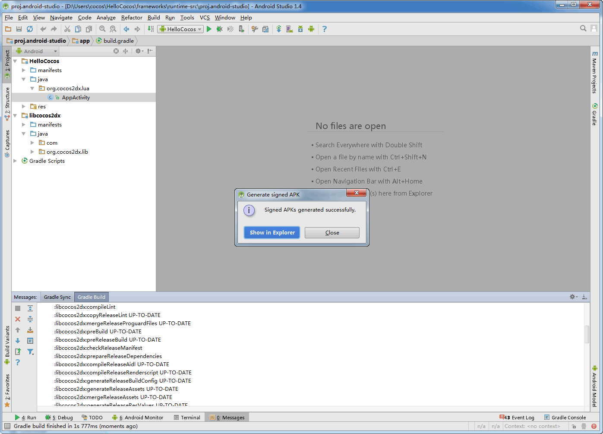

&emsp;&emsp;&emsp;&emsp;&emsp;&emsp;&emsp;&emsp;&emsp;&emsp;&emsp;&emsp;&emsp;&emsp;&emsp;&emsp;&emsp;&emsp;&emsp;&emsp;&emsp;&emsp;图16：Andoid APK生成完毕