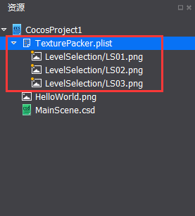
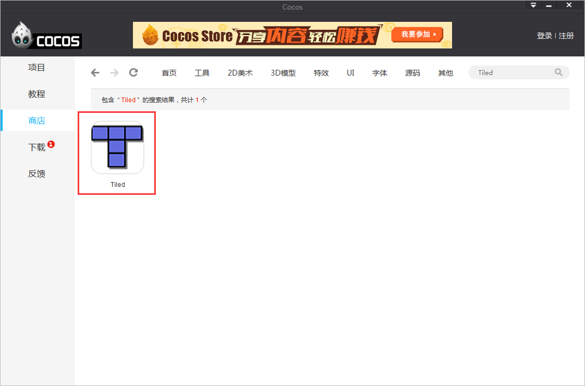
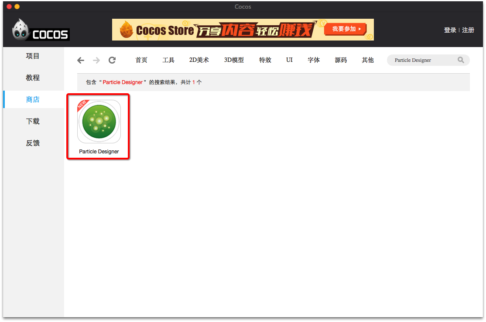

# 使用外部编辑器

&emsp;&emsp;Cocos 2d-x支持的所有外部工具，Cocos Studio也全部都支持，把这些外部的工具导出的数据，导入到资源面板，再配合上Cocos Studio现有的控件就可以使用了，下面介绍一下几种编辑器的使用方法。

### 1.Texture Packer

&emsp;&emsp;1）在商店里面下载Texture Packer，如下图：

&emsp;&emsp;2）使用Texture Packer，导出plist合图为：

&emsp;&emsp;TexturePacker.plist TexturePacker.png，右键点击编辑器资源面板，选择“导入资源…”，选择TexturePacker.plist，导入成功后如下图：

&emsp;&emsp;
 
&emsp;&emsp;3）资源面板会自动展开当前plist所包含的png图片，这样就可以拖plist合图里面的文件给控件赋值了，当发布之后，控件所使用的图片就是plist合图图片。

### 2.Tiled

&emsp;&emsp;1）在商店中下载Tiled

 
&emsp;&emsp;2）使用Tiled导出地图文件为：

&emsp;&emsp;sewers.tmx sewers.png，右键点击编辑器资源面板，选择“导入资源…”，选择sewers.tmx，导入成功后如下图：

&emsp;&emsp;

&emsp;&emsp;3）添加一个地图控件到渲染区，就可以给地图控件赋值了。

### 3.Particle Designer（仅有Mac版本）

&emsp;&emsp;1)在商店里下载Particle Designer

&emsp;&emsp;2)使用Particle Designer，导出plist特效粒子文件为：
&emsp;&emsp;blue.plist，右键点击编辑器资源面板，选择“导入资源…”，选择blue.plist，导入成功后如下图：

&emsp;&emsp;

### 4.Particle Universe

&emsp;&emsp;为了让广大开发者实现绚丽的3D粒子特效，我们Studio支持Particle Universe（基于OGRE的免费粒子编辑器）导出的3D粒子特效。首先，用户需要在Particle Universe制作好粒子的特效文件。如下图所示的pu文件，材质,贴图和脚本分别位于materials/texture/script文件夹中：

&emsp;&emsp;

&emsp;&emsp;1）用户保持粒子文件的文件夹结构不变，导入到Studio中，如下图所示：

&emsp;&emsp;
 
&emsp;&emsp;2）用户把Script文件夹下的pu文件，拖入到场景中使用。

