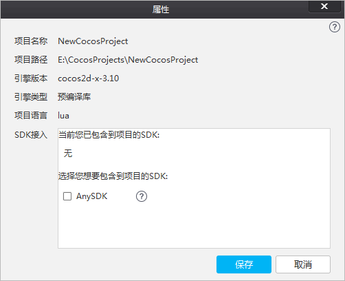
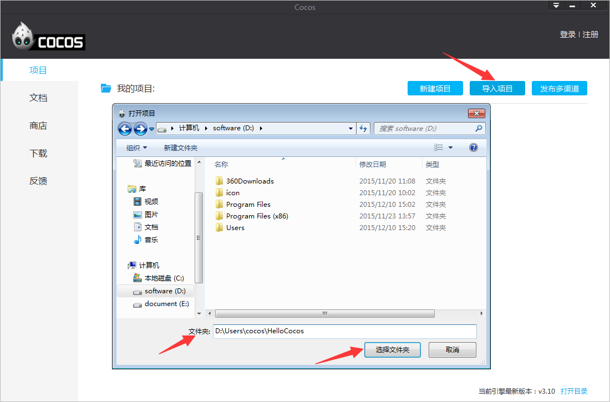
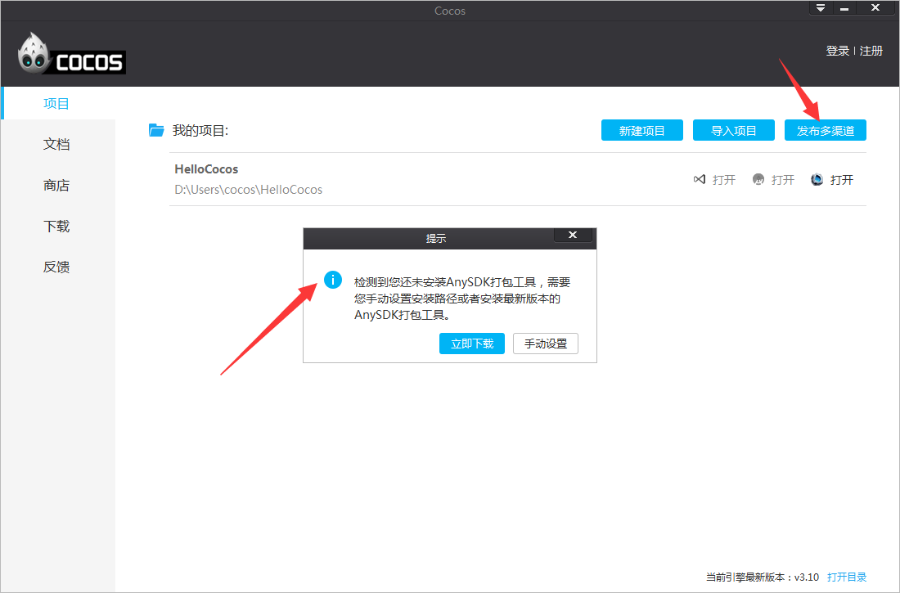
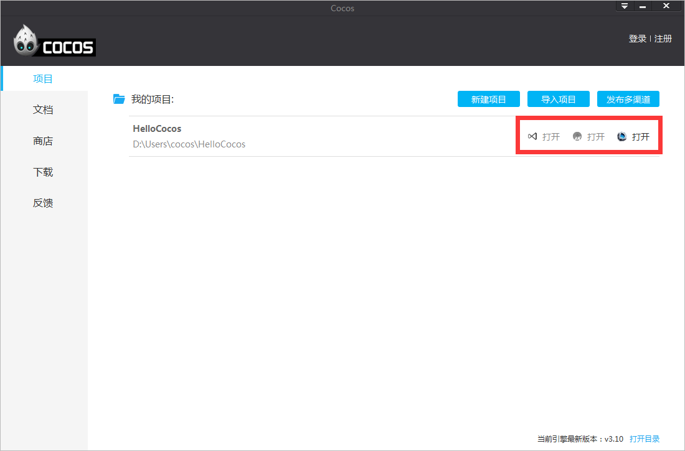
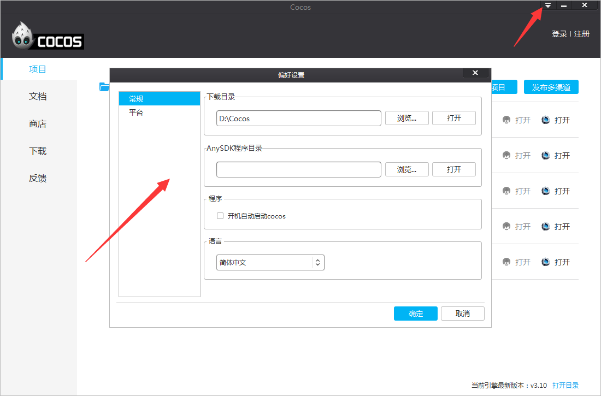
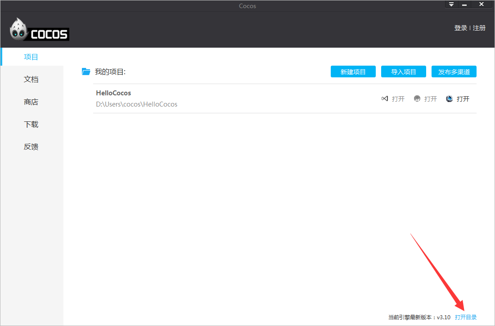
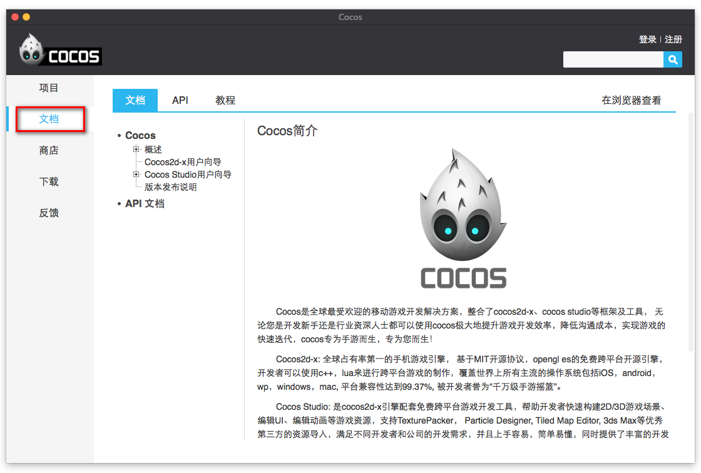
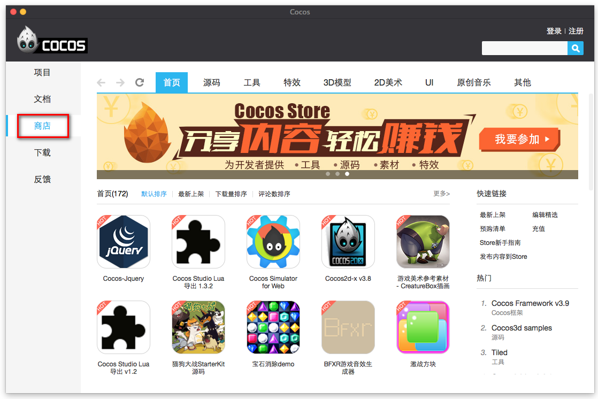
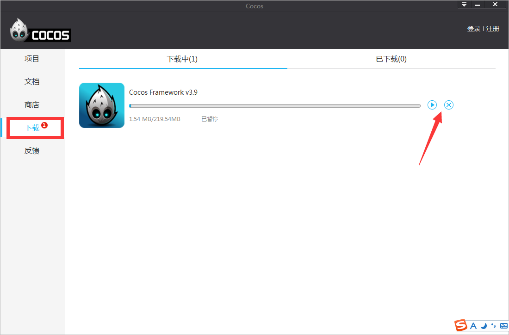
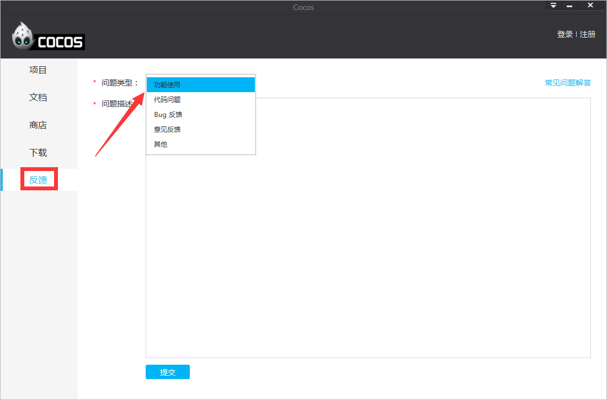

# 认识cocos

使用cocos启动器，您将可以快速新建项目,导入项目,发布多渠道。

### 1.新建项目 ###

打开启动器，在面板右上角的位置，您可以看到“新建项目”的按钮，点击此按钮，在弹出的“新建项目”界面，按照提示填写项目名称,项目路径,引擎版本,引擎类型,项目语言,编辑器,SDK接入，然后点击“完成”即可创建一个新项目。如图1：

&emsp;&emsp;&emsp;&emsp;&emsp;&emsp;&emsp;&emsp;&emsp;&emsp;&emsp;&emsp;&emsp;&emsp;&emsp;&emsp;&emsp;**图1. 新建项目界面**

&emsp;&emsp;**项目名称**：游戏项目名称。

&emsp;&emsp;**项目路径**：游戏项目所在的路径。

&emsp;&emsp;**引擎版本**：选择基于哪个cocos2d-x的版本创建项目。

&emsp;&emsp;**引擎类型**：
         
&emsp;&emsp;&emsp;&emsp;&emsp;&emsp;预编译库：基于cocos2d-x源代码编译而成的二进制库。

&emsp;&emsp;&emsp;&emsp;&emsp;&emsp;源代码：基于cocos2d-x源代码。

&emsp;&emsp;**项目语言**：

&emsp;&emsp;&emsp;&emsp;&emsp;&emsp;Lua：脚本语言，基于cocos2d-x luabinding（将cocos2d-x接口绑定到lua层并加入Quick Lua框架），可以运行在Android,iOS,Windows Phone,Windows,Mac。

&emsp;&emsp;&emsp;&emsp;&emsp;&emsp;JavaScript：脚本语言，基于cocos2d-js引擎，cocos2d-js引擎包含cocos2d-x JavaScript binding（将cocos2d-x的接口绑定到JavaScript层）和cocos2d-js（纯JavaScript引擎），JavaScript binding和Html5接口兼容，同一套JavaScript游戏逻辑代码既可以驱动cocos2d-x runtime，也可以驱动Html5原生引擎，当打包到Android,iOS,Windows Phone,Windows,Mac平台的时候默认基于JavaScript binding，打包到HTML5基于cocos2d-js引擎。

&emsp;&emsp;&emsp;&emsp;&emsp;&emsp;C++：编译型语言，基于cocos2d-x引擎，可以运行在Android,iOS,Windows Phone,Windows,Mac。

&emsp;&emsp;**编辑器**：是否创建cocos2d-x官方编辑器Cocos Studio项目文件。

&emsp;&emsp;**SDK接入**：是否添加AnySDK服务。

### 2.我的项目 ###

&emsp;&emsp;根据需求选择参数设置，点击“完成”，cocos项目就创建成功了。新创建的cocos项目将被添加到“我的项目”，如图2：

&emsp;&emsp;&emsp;&emsp;&emsp;&emsp;&emsp;&emsp;&emsp;&emsp;&emsp;&emsp;&emsp;&emsp;&emsp;&emsp;&emsp;&emsp;&emsp;&emsp;&emsp;&emsp;&emsp;&emsp;&emsp;&emsp;&emsp;&emsp;&emsp;&emsp;**图2. 我的项目** 

&emsp;&emsp;右键“属性”，会打开“编辑项目”窗口，显示当前项目信息以及进行服务的二次接入，如图3：

&emsp;&emsp;&emsp;&emsp;&emsp;&emsp;&emsp;&emsp;&emsp;&emsp;&emsp;&emsp;&emsp;&emsp;**图3. 项目属性** 

### 3.导入项目 ###

在启动器面板，点击右上角的“导入项目”按钮，进入项目导入界面，选择要导入的cocos项目文件夹，点击“选择文件夹”按钮，完成项目导入，如图4：
	

&emsp;&emsp;&emsp;&emsp;&emsp;&emsp;&emsp;&emsp;&emsp;&emsp;&emsp;&emsp;&emsp;&emsp;&emsp;&emsp;&emsp;&emsp;&emsp;&emsp;&emsp;&emsp;&emsp;&emsp;&emsp;&emsp;&emsp;&emsp;&emsp;&emsp;**图4. 导入项目** 

### 4.发布多渠道 ###

在启动器面板，点击“发布多渠道”按钮，您将体验到AnySDK一站式渠道接入服务。如果系统检测到您的电脑里还未安装SDK打包工具，会弹出提示框。点击“立即下载”下载打包工具，点击“手动设置”按钮，配置AnySDK路径。如图5：

&emsp;&emsp;&emsp;&emsp;&emsp;&emsp;&emsp;&emsp;&emsp;&emsp;&emsp;&emsp;&emsp;&emsp;&emsp;&emsp;&emsp;&emsp;&emsp;&emsp;&emsp;&emsp;&emsp;&emsp;&emsp;&emsp;&emsp;&emsp;&emsp;&emsp;**图5. 发布多渠道** 

### 5.打开项目 ###
在“我的项目”的项目路径右侧，有三个"打开"按钮。单击相应的图标或文字表示,使用“Visual Studio”,“Android Studio”和“Cocos Studio”中打开项目，鼠标悬停在图标或者“打开”上，将会出现相应的提示信息。如图6：

&emsp;&emsp;&emsp;&emsp;&emsp;&emsp;&emsp;&emsp;&emsp;&emsp;&emsp;&emsp;&emsp;&emsp;&emsp;&emsp;&emsp;&emsp;&emsp;&emsp;&emsp;&emsp;&emsp;&emsp;&emsp;&emsp;&emsp;&emsp;&emsp;&emsp;**图6. 打开项目** 

### 6.偏好设置 ###
在启动器面板，点击右上角的三角图标，弹出3个选项，点击“偏好设置...”，您将看到如图7所示界面。其中包括下载目录，AnySDK程序目录，勾选是否开机启动cocos和启动器的语言，有简体中文，繁体中文和英文可供选择，如图7：

&emsp;&emsp;&emsp;&emsp;&emsp;&emsp;&emsp;&emsp;&emsp;&emsp;&emsp;&emsp;&emsp;&emsp;&emsp;&emsp;&emsp;&emsp;&emsp;&emsp;&emsp;&emsp;&emsp;&emsp;&emsp;&emsp;&emsp;&emsp;&emsp;&emsp;**图7. 偏好设置** 

### 7.打开目录 ###

点击启动器右下角“打开目录”按钮，将打开cocos2d-x安装目录，cocos2d-x引擎源代码包含其中，如图8：

&emsp;&emsp;&emsp;&emsp;&emsp;&emsp;&emsp;&emsp;&emsp;&emsp;&emsp;&emsp;&emsp;&emsp;&emsp;&emsp;&emsp;&emsp;&emsp;&emsp;&emsp;&emsp;&emsp;&emsp;&emsp;&emsp;&emsp;&emsp;&emsp;&emsp;**图8. 打开目录** 

### 8.其他侧边栏标签 ###

启动器左侧有5个标签，分别为项目,文档,cocos商店,下载和反馈。

### 文档 ###

打开启动器，点击左侧“文档”标签，您将看到cocos2d-x 用户向导，API文档和cocos studio用户向导与教程，如图9：

&emsp;&emsp;&emsp;&emsp;&emsp;&emsp;&emsp;&emsp;&emsp;&emsp;&emsp;&emsp;&emsp;&emsp;&emsp;&emsp;&emsp;&emsp;&emsp;&emsp;&emsp;&emsp;&emsp;&emsp;&emsp;&emsp;&emsp;&emsp;&emsp;&emsp;**图9. 文档** 

### 商店 ###
打开启动器，点击左侧“商店”标签按钮进入Cocos Store。Cocos Store包含了工具,2D美术,3D模型,特效,UI,字体,源码及其他版块，涵盖几乎所有游戏开发工具素材类别，[Cocos Store网页版](https://store.cocos.com/) 也已上线，如图10：

&emsp;&emsp;&emsp;&emsp;&emsp;&emsp;&emsp;&emsp;&emsp;&emsp;&emsp;&emsp;&emsp;&emsp;&emsp;&emsp;&emsp;&emsp;&emsp;&emsp;&emsp;&emsp;&emsp;&emsp;&emsp;&emsp;&emsp;&emsp;&emsp;&emsp;**图10. 商店** 

### 下载 ###

打开启动器，点击左侧“下载”标签按钮进入下载界面。您在商店搜索到需要的资源，点击“立即下载”按钮，下载的文件将会列在“下载”界面，您可以暂停或者取消要下载的文件。如图11：

更改默认的下载位置，点击启动器右上角的三角图标，选择“设置”，找到“下载目录”部分，点击“浏览”，更改默认下载位置，然后点击“选择文件夹”保存设置。

&emsp;&emsp;&emsp;&emsp;&emsp;&emsp;&emsp;&emsp;&emsp;&emsp;&emsp;&emsp;&emsp;&emsp;&emsp;&emsp;&emsp;&emsp;&emsp;&emsp;&emsp;&emsp;&emsp;&emsp;&emsp;&emsp;&emsp;&emsp;&emsp;&emsp;**图11. 下载**

### 反馈 ###

开发者可以在反馈界面提交建议及问题，cocos技术支持团队将通过邮件回复您。如图12：

&emsp;&emsp;&emsp;&emsp;&emsp;&emsp;&emsp;&emsp;&emsp;&emsp;&emsp;&emsp;&emsp;&emsp;&emsp;&emsp;&emsp;&emsp;&emsp;&emsp;&emsp;&emsp;&emsp;&emsp;&emsp;&emsp;&emsp;&emsp;&emsp;&emsp;**图12. 反馈**
