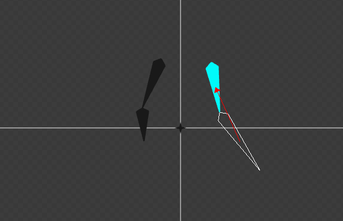
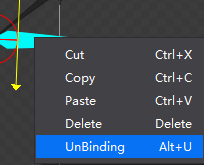
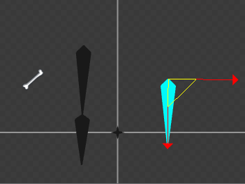

# Edit Skeletal Animation

### 1. Create Bones

Click the Binding button on the Tools panel to create multiple bones. Hierarchical relationship between every two connected bones are shown by using an arrow pointing to the parent node. Press the button again or right click the mouse to stop creating a new bone. 

Now if you press the Create Bone button on the Tools panel, you will create a bone that has root as its parent. 

### 2. Bind Bones

To bind the bones, do the following:

- Click the Binding button  on the Tools panel.

- Select a bone that you want to bind to a parent bone. Now you can see a cube icon at the right bottom corner  of the mouse.

- Click the parent bone to establish a hierarchical relationship. 

Before binding:

After binding: 

Bind skin to bones in the same way you bind the bones. 

### 3.Unbind Bones

To unbind the hierarchical relationship between connected bones, do the following:

-  Select the bone or skin conponents that you want to unbind on the Animation panel.  

- Click the Unbinding button  on the Tools panel. Or right click a component, and then select Unbinding on the context menu.  

&emsp;&emsp;&emsp;

### 4.Set the Position of Bones

Click these buttons  to move the canvas, move/ rotate or scale the bones. 

- Move 

Move the vertical arrow to change the Y-axis value. Move the horizontal arrow to change the X-axis value.  Select the red rectangle to move the skeleton to any direction. 

You can also modify X and Y axis values in the Properties panel. 

- Rotate

Select the arrow on the bone's left to rotate the bone  clockwise.  Select the arrow on the bone's right to rotate the bone counter clockwise. You can also modify the rotation value in the Properties panel. 

- Scale

Click and move the left arrow to scale the bone in X-axis direction. Click and move the right arrow to scale the bone in Y-axis direction. Click and move the triangle between the two arrow to scale the bone evenly in all directions. 

### 5. Skeletal Animation Panel

Skeletal Animation panel is shown below. The list on the left is the hierarchical relationship of bones, and on the right side there is an animation timeline. 

The hierarchical relationship between bones, between bones and skin, is shown on the left list.

The workflow of building a skeleton animation is similar to the general animation workflow in cocos. Create a keyframe in Timeline, and then edit the skeletons on the keyframe.  
