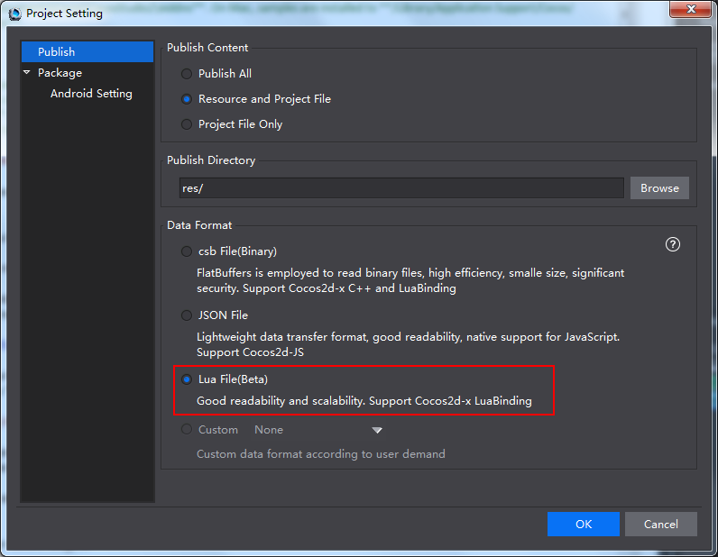
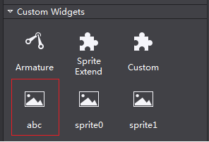
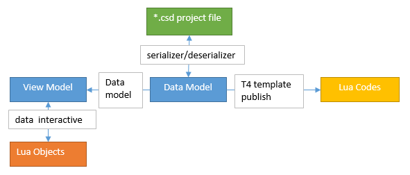
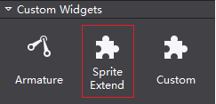
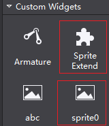

#Widgets Extension#

### Overview ###

This section introduces two ways to create widgets: 

- (basic level) Create widgets for Cocos Studio in Lua; 

- (advanced level) Create widgets for Cocos Studio in C# + Lua. 

### About Readers ###

This section assumes the reader has the following knowledge: 

- Have good knowledge of Cocos Studio.

- Be familiar with Lua scripts.

- Proficiency in Lua interface exported from Cocos 2d-x. 

- Have basic knowledge of C# (high requirement necessary for advanced articles). 

### Background ###

To understand the contents of this document, you need to understand the following concepts:

- [Lua](http://www.lua.org/)

- Cocos 2d-x Lua Binding. 

- [Mono.Addins](http://monoaddins.codeplex.com/)

- [T4 templates](https://msdn.microsoft.com/en-us/library/bb126445.aspx)

### Directory Path

The directory paths which used in this document are listed below for easy reference. All the paths are the default path of Cocos Studio on Window. 

- Addins Path

    By default samples are installed to  **%userprofile%\Documents\Cocos\CocosStudio2\Addins** on the computer. If the default installation folder is changed, samples are in the same folder with Documents. For example, if document is installed to **D:\CocosDocuments**, samples are in **D:\CocosDocuments\Cocos\CocosStudio2\Addins**. On Mac, samples are installed to **/Library/Application Support/Cocos/CocosStudio2/Addins**.

- Sample Path

    By default samples are installed to  **%userprofile%\Documents\Cocos\CocosStudio2\Samples\Addins** on the computer. If the default installation folder is changed, samples are in the same folder with Documents. For example, if document is installed to **D:\CocosDocuments**, samples are in ** D:\CocosDocuments\Cocos\CocosStudio2\Samples\Addins**. On Mac, samples are installed to **/Library/Application Support/Cocos/CocosStudio2/Samples/Addins**. 

### Custom Widgets ###

Currently there are two ways to create custom widgets for Cocos Studio. The following will explore how they are used to create custom widgets. 

- Only Lua codes, it is a fundamental method to create custom widgets. This method can be applied to edit existing widgets in Cocos Studio. 

- C# and Lua, it offers more possibilities to create custom widgets. 

If there are custom widgets created with Lua, these Lua files are necessary when loading scenes. Lua data format is added in Cocos Studio for developers to easily create scenes in Lua. 

You need to select Lua File (Beta) when publishing projects with Lua custom widgets. Otherwise, custom widgets will not show. For example, if a project is published as *.csb* file, its Lua widget is not usable. If other data format is required, see **Customizing Export Data Formats**.  

### 1 Basic Level (Lua) ###

When Cocos Studio starts, it scans the LuaScript directory under plugin directory. Lua files will be recognized as custom widgets edited in Lua. Custom widgets will be displayed in Objects panel with the same name as Lua files' name. 

To modify, expand or set default values to a widget, you can use Lua scripts to accomplish this acquirements. For example, to set the default text font. 

- Create Lua scripts for custom widgets. 

- Put the codes in the LuaScript folder under plugin directory.  

Following is a sample: A custom Sprite widget with text. The sample below is **abc.lua** in LuaScript directory. 

#### Sample

**TextSprite**:  to display some texts on top of the Sprite. 

Following are the codes of **abc.lua**.  

    
    local container = {}
    
    function container.CreateCustomNode()
    	local rootNode = cc.Sprite:create('temp.png') 
    	local label = cc.Label:create()
    	label:setString('abc Label From Lua') 
    	label:setSystemFontSize(24) 
    	label:setPosition(140, 50)
    	label:setName('labelName') 
    	label:retain() 
    	
    rootNode:addChild(label)
    return rootNode
    end
    
    function container.GetBaseType()
    return 'Sprite'
    end
    
    return container

**Analysis**: 

The example above is a complete Lua template. Loading the template will return a Lua Table, which is the container table at the end of the above codes. 

The method `GetBaseType` is  used to return the extended widget type. In this case, "Sprite" is returned, which means the extended widget is "sprite". 

The method `CreateCustomNode` is used to return a node, which is an extended widget in this example. 

Supposed the file **abc.lua** has been copied into LuaScript directory under Plugin directory, and meanwhile **temp.png** is in that directory. 

Start Cocos Studio, and then you will see the custom widget, with the name "abc", in the Objects panel. 

The widget's icon is same as Sprite, for this custom widget is extended based on Sprite. 

Drag and drop "abc" to rendering section, you can see the following (background picture is temp.png).  

Selecting it in the rendering section, we can see that its type is Sprite. 

#### FAQ & Notes

- What to do if custom widgets do not display on Panel?

    Solution: The codes and a picture named temp.png should be in the LuaScript folder under plugin directory. Otherwise, this Lua file cannot be loaded when Cocos Studio starts. 
    
    Resources used in Lua scripts should also be put in LuaScript directory, and be loaded in relative path. When publish a project, LuaScript directory will be copied to publish directory. LuaScript directory is just copied once, if there is a directory with the same name in publish directory, LuaScript directory will not be copied.

     A Lua file is a complete Lua template. Loading the template will return a Lua Table

    The method `CreateCustomNode` has to be used to return a node.

    "Lua Table" must include a method `GetBaseType`, which is used to return a widget's node. Widgets in Cocos Studio and their GetBaseType are listed below:

          控件名	                             GetBaseType返回
         Sprite	                             Sprite
         ParticleSystemQuad                  Particle
         TMXTiledMap                         GameMap
         ComAudio	                         SimpleAudio
         Node	                             Node
         Button	                             Button
         CheckBox       	                 CheckBox
         ImageView	                         ImageView
	     TextBMFont	                         TextBMFont
	     LoadingBar	                         LoadingBar
	     Slider	                             Slider
	     Text	                             Text
	     TextField  	                     TextField
	     ScrollView	                         ScrollView
	     ListView	                         ListView
	     PageView                            PageView
	     Particle3D	                         Particle3D
	     Sprite3D     	                     Sprite3D								
         UserCamera                          UserCamera

- How to call third party's Lua codes library from custom widget's Lua codes library?  

    Solution: Currently Lua runtime of Cocos Studio only supports interfaces exported from Cocos 2d-x. If other interfaces need to be loaded, please load it in Lua codes. For example, if you need lua interface provided by Quick-cocos2d-x, load the  required library in the codes. 

- A custom widget should be defined by one Lua file. A Lua file should define only one custom widget. Cocos Studio will load all the Lua files in LuaScript directory, and each Lua file is represented by a widget's icon in Objects' panel. Name of the icon is same with files' names. 

- There is a project having Lua custom widgets. If Lua scripts have been modified, it will be opened with new scripts. If there is any mistake during the loading process, the corresponding widget will not be displayed. 

- Best Practice: create required widgets in Cocos Studio, and then publish the project as Lua file. 

Above is the introduction of creating custom widgets in Lua. However, you can only create a simple custom widget in Lua. 

### 2 Advanced Level (C# & Lua) ###

To modify widgets' properties, you need to write codes in C#. 

Cocos Studio build its addin system based on Mono.Addins, which is helpful when we want to expand properties.   

Export the expanded widget to Lua file (generated by adding a template to generate Lua codes). A concept diagram about this process is listed below:

&emsp;&emsp;&emsp;&emsp;&emsp;&emsp;&emsp;&emsp;

***Note** Lua Objects are the Lua scripts of custom widgets. Lua Codes are exported from Data Model.* 

Generally speaking, following are steps to implement this operation: 

- Create scripts for custom widgets. 

- Put the scripts created in previous step in LuaScript folder under plugin directory. 

- Configure AddinConfig.cs.  

- Add ViewModel and DataModels.

- Add a template to generate Lua codes.

Here is an example: 

There is a TextSprite widget, when selected, you can modify the contents and font size of the text. 

Find Addins.sln in Samples folder. Open Addins.sln in Visual Studio 2013. 

The Samples and Analysis below are based on this example. 

#### Samples

Add a method to deal with text contents and font size in Lua scripts. In LuaScript directory, scripts of sprite0.lua are listed below: 

    --[[
       ]]
    		
   
    	local function CreateSprite()
    		return cc.Sprite:create('temp.png') 
    	end
    	
    	local function CreateLabel()
    		local label = cc.Label:create()
    		label:setString('sprite0 Label from Lua')
    		label:setSystemFontSize(24)
    		label:setPosition(140, 50)
    		label:setName('labelName') 
    		label:retain()
    		return label
    	end

    	-- make sure ccslog is not empty
    	local ccslog = ccslog
    	if not ccslog then
    	    ccslog = function(...) end
    	end

    	local container = {}
    
    	function container.CreateCustomNode()
    		local rootNode = CreateSprite()
    		rootNode:addChild(CreateLabel())
    		return rootNode
    	end
    
    	function container.GetBaseType()
    	return 'Sprite'
    	end
    

    	function container.GetLabelText(root)
    	local child = root:getChildByName('labelName')
    	return child:getString()
    	end
    

    	function container.SetLabelText(root, value)
    	local child = root:getChildByName('labelName')
    	child:setString(value)
    	end
    
    	function container.GetLabelFont(root)
    	local child = root:getChildByName('labelName')
    	return child:getSystemFontSize()
    	end
    	
    	function container.SetLabelFont(root, value)
    	local child = root:getChildByName('labelName')
    	child:setSystemFontSize(value)
    	end
    	
    	return container

**Analysis**

We have discussed how to create TextSprite in basic level section. Now let's see two methods of Set/Get, which will be used in C#: 

- GetLabelText/SetLabelText: to get/ set text contents on Sprite. 

- GetLabelFont/SetLabelFont: to get/ set font size on Sprite. 

Some operations are implemented by Lua interface exported from Cocos 2d-x.  

In Cocos Studio version 3.10, add a `ccslog` function for print message to Cocos Studio output area。The usage of `ccslog` is the same as `print` in lua, you can find a sample in sprite0.lua code in the sample project of Cocos Studio 3.10。

Scripts of LuaCustomObject: 

    [DisplayName("Sprite Extend")]
    [ModelExtension(2)]
    [ControlGroup(ViewObjectCategory.CustomGroupKey, 2)]
    [EngineClassName("LuaCustom")]
    public class LuaCustomObject : SpriteObject
    {
        public LuaCustomObject()
            : base(GetScriptFileData())
        {
            if (System.IO.File.Exists(luaFile))
                luaValueConverter = new LuaValueConverter(luaFile, this);
            else
                throw new System.IO.FileNotFoundException(luaFile + " not found!");
        }

        private LuaValueConverter luaValueConverter;

        private static string luaFile = GetLuaFilePath();

        private static ScriptFileData GetScriptFileData()
        {
            if (System.IO.File.Exists(luaFile))
            {
                CSCocosHelp.AddSearchPath(Path.GetDirectoryName(luaFile));
                return new ScriptFileData(luaFile, ScriptType.Lua);
            }

            LogConfig.Output.Info(luaFile + " not exist!");
            return null;
        }

        /// 

        /// get lua file path according to current running assembly.
        /// lua script file should in a folder "LuaScript" which is in current running assembly parent folder.
        /// e.g. current running assembly is in "Addins", lua file path is "Addins/LuaScript/sprite0.lua"
        ///
        ///      Addins
        ///      ├─Addins.Sample.dll (current running assembly)
        ///      └─LuaScript
        ///          ├─ sprite0.lua
        ///
        /// you can modify "LuaScript" or lua file name "sprite0.lua" to other name as you like.
        /// NOTICE: only Addins/LuaScript folder will be copied to target folder. if lua script is in other
        /// folder, user should write extra codes to copy it to target folder, e.g. use CustomSerializer to do the job.
        /// 

        /// <returns>lua file path</returns>
        private static string GetLuaFilePath()
        {
            string assemblyFolder = Path.GetDirectoryName(Assembly.GetExecutingAssembly().Location);
            string luaScriptFolder = Path.Combine(assemblyFolder, "LuaScript");

            // make sure luaFile exists, if not, please copy it from source folder to target.
            // you can find the lua script file in "../LuaScript/" folder as "."(current folder) is the one
            // who contains current file LuaCustomObject.cs.(here "." is "Addins.Sample/Lua/ViewModel")
            //  
            //  ├─LuaScript
            //  │   ├─ sprite0.lua
            //  │
            //  └─ViewModel
            //      ├─ LuaCustomObject.cs (current file)
            //
            string luaFilePath = Path.Combine(luaScriptFolder, "sprite0.lua");

            return luaFilePath;
        }

        protected override string GetNamePrefix()
        {
            return "LuaSprite_";
        }

        [UndoProperty]
        [DefaultValue("abc")]
        [DisplayName("Label Text")]
        [Category("Group_Feature")]
        [Browsable(true)]
        [PropertyOrder(0)]
        public string LabelText
        {
            get
            {
                return luaValueConverter.GetStringValue("GetLabelText");
            }
            set
            {
                luaValueConverter.SetStringValue("SetLabelText", value);
                this.RaisePropertyChanged(() => this.LabelText);
            }
        }

        [UndoProperty]
        [DisplayName("Label Font")]
        [Category("Group_Feature")]
        [Description("Int value description")]
        [PropertyOrder(1)]
        [Browsable(true)]
        public int LabelFont
        {
            get
            {
                return luaValueConverter.GetIntValue("GetLabelFont");
            }
            set
            {
                luaValueConverter.SetIntValue("SetLabelFont", value);
                this.RaisePropertyChanged(() => this.LabelFont);
            }
        }

        #region methods for clone

        // set value to the object, used in clone.
        protected override void SetValue(object cObject)
        {
            base.SetValue(cObject);

            LuaCustomObject nObject = cObject as LuaCustomObject;
            if (nObject == null)
                return;
            nObject.LabelText = this.LabelText;
            nObject.LabelFont = this.LabelFont;
        }

        #endregion methods for clone
    }

**Analysis**

Since this custom widget is Sprite, it inherits from SpriteObject. 

DisplayName Property: widget's name is displayed in Objects panel, while here "Sprite Extend" is displayed. 

ModelExtension Property: export ViewModel of the custom widget, with Type as its parameter. The custom widget will show on Custom Widget panel with name "Sprite Extend". 

If the extended custom widget is a 3D widget, a 3D parameter should be added in ModelExtension. 

    [ModelExtension(2, EnumModelType.ThreeDimensional)]

Category Properties: `Control_Custom` means that to show the widget on Custom Widgets panel. 

EngineClassName: a widget name, which will show as Type on Properties panel. Here widgets will show their type the same as what they are in Cocos 2d-x. 

LabelText and LabelFont have been added to extended properties, and they are displayed on Properties panel as following: 

In Cocos Studio, each ViewModel has a DataModel that contains all the data information. For example, DataModel will be serialized and saved to .csd files. 

**Data Model**

Scripts of LuaCustomObjectData: 

	[DataModelExtension(typeof(LuaCustomObject))]
	public class LuaCustomObjectData : SpriteObjectData
	{
	    [ItemProperty]
	    [JsonProperty]
	    public string LabelText { get; set; }
	
	    [ItemProperty]
	    [JsonProperty]
	    public int LabelFont { get; set; }
	}

**Analysis**

Since this custom widget is Sprite, it inherits from SpriteObjectData.

Add DataModelExtension property, with its value LuaCustomObject. 

***Note** DataModel and ViewModel should have same name.* 

Now let's see how to realize the interaction between expanded properties and Lua codes of ViewModel. C# codes are listed below: 

**Data Interaction**

    [UndoPropertyAttribute]
    [DefaultValue("abc")]
    [DisplayName("Label Text")]
    [Category("Group_Feature")]
    [Browsable(true)]
    [PropertyOrder(0)]
    public string LabelText
    {
        get
        {
            return luaValueConverter.GetStringValue("GetLabelText");
        }
        set
        {
            luaValueConverter.SetStringValue("SetLabelText", value);
            this.RaisePropertyChanged(() => this.LabelText);
        }
    }

    [UndoPropertyAttribute]
    [DisplayName("Label Font")]
    [Category("Group_Feature")]
    [Description("Int value description")]
    [PropertyOrder(1)]
    [Browsable(true)]
    public int LabelFont
    {
        get
        {
            return luaValueConverter.GetIntValue("GetLabelFont");
        }
        set
        {
            luaValueConverter.SetIntValue("SetLabelFont", value);
            this.RaisePropertyChanged(() => this.LabelFont);
        }
    }

**Analysis**

The `luaValueConverter.GetStringValue` is a string value obtained from Lua codes. The parameter “GetLabelFont” means to get the texts on Sprite. Pay attention to the correspondent relationship between method and Lua codes, which is similar to the interaction among other data. 

`Set` in properties will call `this.RaisePropertyChanged` at last, to notify the properties' values have been changed and to refresh Properties panel. 

Copy `Addins.Sample.dll` to Addins directory of Cocos Studio. Follow the rules for Cocos Studio's Addins, we need to add the following features to the project.  

Since the convention Cocos Studio plug- scheme used, the need to generate an assembly , add the following features:

**Add AddinConfig.cs**

Add AddinConfig.cs to project: 

     // "3.10" is version of the this Addin. Addin should match its dependency with the same version.
    [assembly: Addin("Addins.Sample", "3.10", Namespace = Option.AddinNamespace)]
    
    // "3.10" is the version of Addin dependency.
    [assembly: AddinDependency("CocoStudio.Core", "3.10")]
    [assembly: AddinDependency("CocoStudio.Projects", "3.10")]
    [assembly: AddinDependency("CocoStudio.Model", "3.10")]
    [assembly: AddinDependency("CocoStudio.Model.Lua", "3.10")]
    [assembly: AddinDependency("CocoStudio.Model3D", "3.10")]
    [assembly: AddinDependency("CocoStudio.Model3D.Lua", "3.10")]
    [assembly: AddinDependency("Addins.LuaExtend", "3.10")]

**Analysis**

Addin export and addin dependence settings. 

Custom widgets are created in Lua. In order to export the expanded properties to Lua, we need to transfer DataModel to Lua codes. 

**Template to generate Lua codes**

We can use T4 template to transfer Datamedel to Lua codes. 

T4 template

	<#@ template debug="false" inherits="LuaSpriteObject" language="C#" linePragmas="false"#>
	<#@ assembly name="System.Core" #>
	<#@ import namespace="System.Linq" #>
	<#@ import namespace="System.Text" #>
	<#@ import namespace="System.Collections.Generic" #>
	<#@ import namespace="CocoStudio.Model.DataModel" #>
	<#@ import namespace="Addins.Sample.Lua.DataModel"#>
	<#@ import namespace="CocoStudio.Model.Lua.Templates" #>
	<#@ import namespace="Mono.Addins" #>
	
	<#+
	public override bool CanSerialize(BaseObjectData objectData)
	{
	    bool isOK = typeof(LuaCustomObjectData) == objectData.GetType();
	    return isOK;
	}
	
	public override void CreateObject(BaseObjectData objectData)
	{
		LuaCustomObjectData data = objectData as LuaCustomObjectData;
	#>
	local luaScript = require("<#= CocoStudio.Basic.Option.luaScriptFolderName #>/<#= System.IO.Path.GetFileName(data.ScriptData.RelativeScriptFile) #>")
	<#= GetNameDeclaration(objectData.Name) #> = luaScript.CreateCustomNode()
	<#+
	}
	
	public override void InitializeObject(BaseObjectData objectData)
	{
		LuaCustomObjectData data = objectData as LuaCustomObjectData;
		base.InitializeObject(data);
	#>
	luaScript.SetLabelText(<#= data.Name #>, "<#= data.LabelText #>")
	luaScript.SetLabelFont(<#= data.Name #>, <#=data.LabelFont#>)
	luaScript.GetLabelVisible(<#= data.Name #>, <#=data.LabelVisible.ToString().ToLower()#>)
	luaScript.SetMixedColor(<#= data.Name #>, <#=data.MixedColor.ToLuaString()#>)
	<#+
	}
	#>

**Analysis**

inherits="LuaSpriteObject": to set T4 template to inherit from LuaSpriteObject. 

CanSerialize：to make sure DataModel is LuaCustomObjectData.

CreateObject: to create Lua codes for the custom widget. 

InitializeObject: to create property codes for the custom widget. 

AddChild: the custom widget is a Sprite, and adding child widget does not require special operation, therefore no need to rewrite AddChild method. 

Each DataModel will correspond to a Lua code template. When extending a widget, Lua code generation template class needs to inherit from widgets' code generation template class.

T4 template uses Monodevelop addin mechanism. It needs a xml export file. When exporting Lua files, the addin mechanism will scan all LuaBaseObject class under **/CocoStudio/Model/Lua/Templates**. When generating Lua codes, Cocos Studio will call CanSerialize to find the corresponding code templates to generate classes. DataModel class will be taken as parameter. 

**Export Template**

T4 template is associated with **LuaObjects.addin.xml** in ExtensionModel directory. In VS2013, **LuaObjects.addin.xml**'s "Build Action" property is "Embedded Resource", and its "Copy to Output Directory" property is "Do not Copy". 

In the extension point of **/CocoStudio/Model/Lua/Templates**, **Addins.Sample.Lua.Lua.LuaCustomObject** the full path generated by T4 template class will be added. Codes are as follows: 
 
	<?xml version="1.0" encoding="utf-8" ?>
	<ExtensionModel>
	<Extension path = "/CocoStudio/Model/Lua/Templates">
		<Class class = "Addins.Sample.Lua.Lua.LuaCustomObject"/>
	</Extension>
	</ExtensionModel>

#### FAQ & Notes

**About Addins**

Cocos Studio build its addin system based on Mono.Addins. Add  AddinConfig.cs in C# project, and set Addin features, and use AddinDependency to set dependence. Put the DLL in **%userprofile%\Documents\Cocos\CocosStudio2\Addins** (Windows file path)。

For more information about Mono.Addins, please see [http://monoaddins.codeplex.com/](http://monoaddins.codeplex.com/). 

**DataModel and ViewModel**

In Cocos Studio, each widget is a ViewModel, and each ViewModel has a DataModel to manage its data. 

ViewModel need to inherit from NodeObject or some subclass of NodeObject depending on the different widgets. Correspondingly, DataModel need to inherit from NodeObjectData and the subclass of NodeObjectData respectively. The interaction between DataModel and ViewModel is realized through DataModelExtension. 

Attribute names for DataModel and ViewModel  should be same. 

**About Serialization**

Serialization in DataModel need to add ItemProperty and JsonProperty, which respectively correspond to XML Serialization and JSON Serialization.    

XML Serialization is handled by MonoDevelop. For details, please see [http://www.monodevelop.com/developers/articles/using-the-data-serializer/](http://www.monodevelop.com/developers/articles/using-the-data-serializer/). 

JSON Serialization is handled by **Newtonsoft.Json Library**. For more information about Newtonsoft, please see [http://www.newtonsoft.com/json](http://www.newtonsoft.com/json). 

**Data Interaction**

LuaValueConverter can be used to transfer data between C# and Lua. 

Methods provided by **LuaValueConverter** are listed below: 

    Method Name	                                                   
	
	bool GetBoolValue(string funcName)	                          
	void SetBoolValue(string funcName, bool val)	               
	int GetIntValue(string funcName)	                          
	void SetIntValue(string funcName, int val)	                   
	string GetStringValue(string funcName)	                       
	void SetStringValue(string funcName, string val)	          
	double GetDoubleValue(string funcName)	                       
	void SetDoubleValue(string funcName, double val)	           
	float GetFloatValue(string funcName)	                       
	void SetFloatValue(string funcName, float val)	               
	System.Drawing.Color GetColorValue(string funcName)	           
	void SetColorValue(string funcName, System.Drawing.Color val)	
	void SetResourceDataValue(string funcName, ResourceData val)	

***Notes*** 

*The above function signature is the method name in C#. Types are same as C# language types.* 

*When calling funName, it should be changed to the method name in Lua.* 

*Only set but get can be performed on resources. You can call GetStringValue to return to resources' path and perform subsequent processing in C# layer.* 

*For interaction between C# and Lua, Cocos Studio currently only supports several predefined types. If there is a need for complex types, try to combine methods and convert types. In subsequent development, we will gradually enrich supported types.* 

**T4 Template**

Create T4 template for DataModel. Export DataModel to Lua files when exporting Cocos Studio projects. 

Rules of T4 template: 

Each widget that needs to be exported to Lua codes corresponds to a T4 template. 

C# files created by T4 template need to inherit from corresponding expanded widget classes. Meanwhile, override the following methods:  

CanSerialier: to judge DataModel type. 

CreateObject: to load the appropriate Lua extension file based on the imported DataModel.  Lua code is generated for a new extension of the widget. 

InitializeObject: to export expanded properties to Lua codes. 

AddChild: If AddChild from NodeObject is not used to add childwidget, you will need to override this method. For example, when adding child widgets for PageView, you need to use AddPage. 

T4 template: [https://msdn.microsoft.com/en-us/library/bb126445.aspx ](https://msdn.microsoft.com/en-us/library/bb126445.aspx ).

Adding association in T4 template, to find this template when Cocos Studio exporting projects to Lua. 

**Related Class Names**

Following are some class names in ViewModel, DataModel and what generated by T4 model: 

    ViewModel Class	         DataModel Class           T4 Model Class
	
	SpriteObject	         SpriteObjectData	       LuaSpriteObject
	ParticleObject	         ParticleObjectData	       LuaParticleObject
	GameMapObject	         GameMapObjectData	       LuaGameMapObject
	SimpleAudioObject	     SimpleAudioObjectData	   LuaSimpleAudioObject
	NodeObject	             NodeObjectData	           LuaNodeObject
	ButtonObject	         ButtonObjectData	       LuaButtonObject
	CheckBoxObject	         CheckBoxObjectData	       LuaCheckBoxObject
	ImageViewObject	         ImageViewObjectData	   LuaImageViewObject
	TextBMFontObject	     TextBMFontObjectData	   LuaTextBMFontObject
	LoadingBarObject	     LoadingBarObjecDatat	   LuaLoadingBarObject
	SliderObject	         SliderObjectData	       LuaSliderObject
	TextObject	             TextObjectData	           LuaTextObject
	TextFieldObject	         TextFieldObjectData	   LuaTextFieldObject
	PanelObject	             PanelObjectData	       LuaPanelObject
	ScrollViewObject	     ScrollViewObjectData	   LuaScrollViewObject
	ListViewObject	         ListViewObjectData	       LuaListViewObject
	PageViewObject	         PageViewObjectData	       LuaPageViewObject
	Node3DObject	         Node3DObjectData	       LuaNode3DObject
	Particle3DObject 	     Particle3DObjectData	   LuaParticle3DObject
	Sprite3DObject	         Sprite3DObjectData	       LuaSprite3DObject
	UserCameraObject	     UserCameraObjectData	   LuaUserCameraObject

***Note** Lua codes or resources are not in LuaScript directory. You need to handle the directory path issue manually. If Lua files are in LuaScript directory, they will be implemented as basic custom widgets without extended properties.* 

     Sprite Extend is a custom widget with extended properties, but sprite0 is the basic custom widget.
 
&emsp;&emsp;

- If you need to create a project, take this tutorial as an example. Target framework is .Net Framework4.5 and output type is Class Library. 

###Samples

- Sample Path

    By default samples are installed to  **%userprofile%\Documents\Cocos\CocosStudio2\Samples\Addins** on the computer. If the default installation folder is changed, samples are in the same folder with Documents. For example, if document is installed to **D:\CocosDocuments**, samples are in **D:\CocosDocuments\Cocos\CocosStudio2\Samples\Addins**. On Mac, samples are installed to **/Library/Application Support/Cocos/CocosStudio2/Samples/Addins**. 

- Compiling Samples 

    Sample is a solution of Visual Studio 2013. You can directly compile Addins.sln on Windows. Mono library and GTK# are essential. Please install them on your computer. 

    On Mac, you need to copy samples to a directory which users have permission to compile. On Mac, you can choose Xamarin Studio to compile. MonoFramework is necessary. 

- Copying DLL

    After successful compile, you will get **Addins.Sample.dll**. Copy it to Addins directory.

    By default samples are installed to  **%userprofile%\Documents\Cocos\CocosStudio2\Addins** on the computer. If the default installation folder is changed, samples are in the same folder with Documents. For example, if document is installed to **D:\CocosDocuments**, samples are in **D:\CocosDocuments\Cocos\CocosStudio2\Addins**. On Mac, samples are installed to **/Library/Application Support/Cocos/CocosStudio2/Addins**.

- If there is any update on Samples, please check the latest version for reference.  For more information about Samples' 
-  For changes, see ChangeLog.txt in Lua folder under Samples directory.  

### Other Important Information

- This document applies to Samples of Cocos Studio v2.2.5+. 

- Names of custom widgets should be given legal Lua variable. Otherwise, the published Lua file cannot be implemented properly. You can enable naming convention in Cocos Studio's configurations. If you give a variable an illegal name, there will be a notification "XX is not a valid Lua variable name" in the output section. 

- In the subsequent development of Cocos Studio, we will extend more interfaces and classes, and provide document for reference. 

***Note** The contents of the document are under continuous update based on users' feedback. Please check the latest version for reference. If you have any suggestions or comments on the extensions of Cocos Studio, please let us know. Thanks for your interest and support for Cocos Studio, and for helping us make a better product.*  