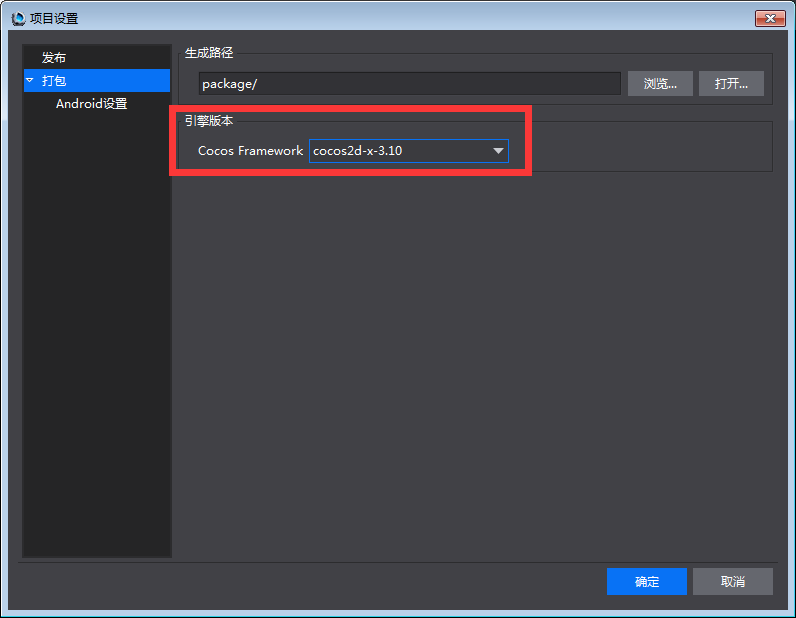

# 升级或降级Cocos Framework #

**基于cocos2d-x 3.10及其之后的版本：**

不再支持通过切换Cocos Framework的版本进行自动升级，支支持手动升级，方法如下：

新建一个基于新的Framework创建的项目，然后将这个项目与升级之后的项目进行对比，把Classes下面的文件以及proj.android，proj，ios_mac，proj.win32里面除掉项目文件其他部分进行手动合并。

**基于cocos2d-x 3.9及其以前的版本：**

当大家安装了多个cocos2d-x的时候，在菜单-》项目（P）->项目设置...-》打包，可以切换Cocos Framework的版本，如图：

         

设置新的Framework后，下一次打包或者运行在设备上的时候，会自动对当前项目进行升级，升级脚本只会把当前项目的proj.XXXX的项目文件中引用库的路径重定向到新的Framework库所在的目录，并不会对当前项目的文件进行合并，包括Classes下面的文件以及proj.XXXX里面除掉项目文件其他部分，所以当大家发现升级后的项目运行不起来的时候，可以采用以下方法进行解决：

新建一个基于新的Framework创建的项目，然后将这个项目与升级之后的项目进行对比，把Classes下面的文件以及proj.android，proj，ios_mac，proj.win32里面除掉项目文件其他部分进行手动合并，这样便可以解决您的问题。

