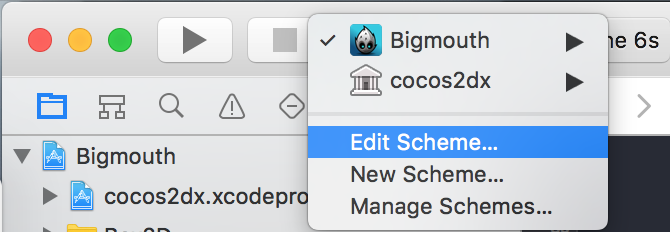
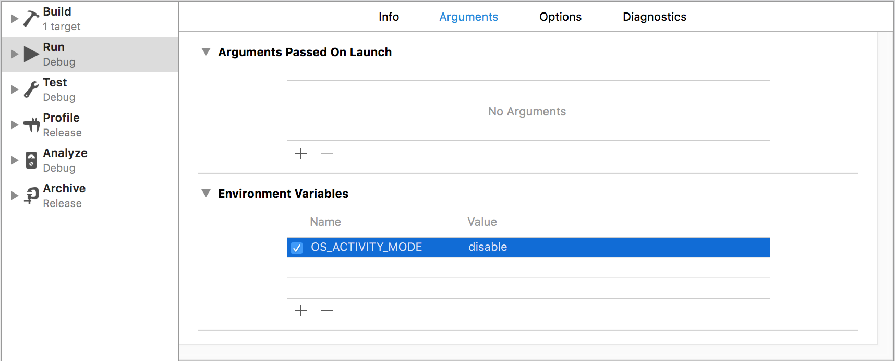

# Xcode 8 Hide strange unwanted logs

更新Xcode 8之后，会打印一堆莫名其妙看不懂的系统Log。

如：

```
2016-09-08 15:33:48.879696 Bigmouth[20610:2418552] subsystem: com.apple.UIKit, category: HIDEventFiltered, enable_level: 0, persist_level: 0, default_ttl: 0, info_ttl: 0, debug_ttl: 0, generate_symptoms: 0, enable_oversize: 1, privacy_setting: 2, enable_private_data: 0
```
解决方法：

Xcode 8里边 `Edit Scheme-> Run -> Arguments`, 在`Environment Variables`里边添加



`OS_ACTIVITY_MODE ＝ disable`




