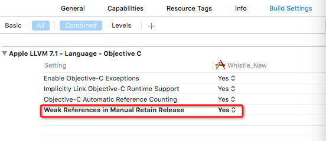

# Xcode 7.3 Cannot create __weak reference in file using manual reference counting

更新Xcode 7.3后编译可能会出现这个错:`cannot create __weak reference in file using manual reference counting`

解决方法：
##### 1.可以设置`build setting -> Apple LLVM7.1 - Language - Objective C -> Weak References in Manual Retain Release YES`



##### 2.用 `__unsafe_unretained` 代替 `__weak`,但是如果用 `__unsafe_unretained`请注意下面的问题。

```
__unsafe_unretained specifies a reference that does not keep the referenced object alive and is not set to nil when there are no strong references to the object. If the object it references is deallocated, the pointer is left dangling.
Answer from Apple:

This issue behaves as intended based on the following: We are in the process of implementing weak references in all Objective-C language modes. Since “__weak” has historically been ignored in non-ARC (and non-GC) language modes, we’ve added this error to point out places where the semantics will change in the future. Please update your bug report to let us know if this is still an issue for you.
```
