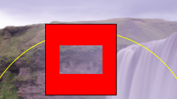
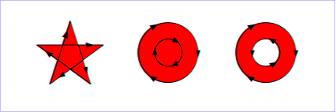
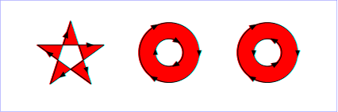

# iOS 利用CAShapeLayer的FillRule属性生成一个空心遮罩的layer

### 1.空心矩形框:

通过设置填充规则为kCAFillRuleEvenOdd，绘制两个Rect的非交集

```
    UIView* aView = [[UIView alloc] initWithFrame:CGRectMake(100,80, 100, 100)];

    [self.view addSubview:aView];

    //用来标识layer的绘图是否正确

    aView.layer.borderWidth = 1.0;

    aView.layer.borderColor = [UIColor blackColor].CGColor;

    CAShapeLayer* cropLayer = [[CAShapeLayer alloc] init];

    [aView.layer addSublayer:cropLayer];

    // 创建一个绘制路径

    CGMutablePathRef path =CGPathCreateMutable();

    // 空心矩形的rect

    CGRect cropRect = CGRectMake(20, 30, 60, 40);

    // 绘制rect
    CGPathAddRect(path, nil, aView.bounds);

    CGPathAddRect(path, nil, cropRect);

    // 设置填充规则(重点)

    [cropLayer setFillRule:kCAFillRuleEvenOdd];

    // 关联绘制的path
    [cropLayer setPath:path];

    // 设置填充的颜色

    [cropLayer setFillColor:[[UIColor redColor] CGColor]];
```

效果图 ：



### 2.空心圆:

通过设置填充规则为kCAFillRuleEvenOdd，绘制Rect和Arc的非交集

```
     CAShapeLayer *pShapeLayer = [CAShapeLayer layer];

     pShapeLayer.fillColor = [UIColor blackColor].CGColor;
[self.overlayView.layer addSublayer:pShapeLayer];
UIBezierPath *pPath = [UIBezierPath bezierPathWithArcCenter:self.overlayView.center radius:SCALE_FRAME_Y/2 startAngle:0.0 endAngle:M_PI*2 clockwise:YES];
     pShapeLayer.path = pPath.CGPath;

     UIBezierPath *pOtherPath = [UIBezierPath bezierPathWithRect:CGRectMake(0, 0, self.view.frame.size.width, self.view.frame.size.height)];

     pShapeLayer.path = pOtherPath.CGPath;

     [pOtherPath appendPath:pPath];

     pShapeLayer.path = pOtherPath.CGPath;

           //重点
     pShapeLayer.fillRule = kCAFillRuleEvenOdd;
```
效果图:


### 重点：理解填充规则 fillRule

```
/* The fill rule used when filling the path. Options are `non-zero' and
 * `even-odd'. Defaults to `non-zero'. */
```

`@property(copy) NSString *fillRule;`
属性用于指定使用哪一种算法去判断画布上的某区域是否属于该图形“内部” （内部区域将被填充）。对一个简单的无交叉的路径，哪块区域是“内部” 是很直观清除的。但是，对一个复杂的路径，比如自相交或者一个子路径包围另一个子路径，“内部”的理解就不那么明确了。

#### `kCAFillRuleNonZero`

字面意思是“非零”。按该规则，要判断一个点是否在图形内，从该点作任意方向的一条射线，然后检测射线与图形路径的交点情况。从0开始计数，路径从左向右穿过射线则计数加1，从右向左穿过射线则计数减1。得出计数结果后，如果结果是0，则认为点在图形外部，否则认为在内部。下图演示了`kCAFillRuleNonZero`规则:



#### `kCAFillRuleEvenOdd`
字面意思是“奇偶”。按该规则，要判断一个点是否在图形内，从该点作任意方向的一条射线，然后检测射线与图形路径的交点的数量。如果结果是奇数则认为点在内部，是偶数则认为点在外部。下图演示了`kCAFillRuleEvenOdd`规则:


