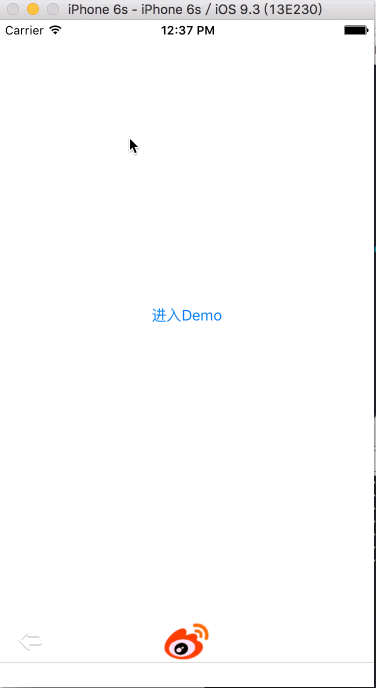

# iOS 实现主题切换

利用通知`NSNotificationCenter`和`NSUserDefaults`实现主题切换。

### 1.先上效果图：



### 2.实现思路：

·首先创建一个单例类用于管理主题 `ThemeManager`：包括主题配置文件的获取及一些操作方法

·创建自定义`ThemeLabel`、 `ThemeButton`、 `ThemeImageView`用于监听切换主题通知，切换对应的图片和字体颜色

·切换主题的时用 `NSUserDefaults`保存主题名称到本地， `NSNotificationCenter` 发送一个`kThemeDidChangeNotification`的通知切换主题

·根据不同的主题在`fontColor.plist` Label字体颜色配置， `theme.plist`文件配置图片文件夹路径

·点击切换主题Cell -> 发出切换主题的通知 -> 响应通知方法重新设置Label字体颜色、Button图片、ImageView的图片

### 3.核心代码：

·`ThemeManager` 主题管理类:单例，用于主题管理和本地存储
·`ThemeLabel` 自定义主题Button 可根据主题切换图片和背景图片
·`ThemeButton` 自定义主题Label 可根据主题切换图片
·`ThemeImageView` 自定义主题ImageView 可根据主题切换字体颜色
·`ThemeUtil` 主题UI创建工具类:封装主题Label、Button、ImageView工厂创建方法

#### `ThemeManager` 管理方法：

```
  @interface ThemeManager : NSObject
  @property(nonatomic,retain)NSString *themeName;
  //主题配置 theme.plist文件
  @property(nonatomic,retain)NSDictionary *themesPlist;
  // Label字体颜色配置 fontColor.plist文件
  @property(nonatomic,retain)NSDictionary *fontColorPlist;
  +(ThemeManager *)shareInstance;
  -(UIImage *)getThemeImage:(NSString *)imageName;
  -(UIColor *)getColorWithName:(NSString *)name;
  @end
```

#### `ThemeLabel`、 `ThemeButton`、 `ThemeImageView` 监听通知：

```
[[NSNotificationCenterdefaultCenter]addObserver:self selector:@selector(themeNotification:) name:kThemeDidChangeNotificationobject:nil];
ThemeLabel：

- (void)themeNotification:(NSNotification *)notification {    [selfsetColor];
}
ThemeButton、 ThemeImageView：

- (void)themeNotification:(NSNotification *)notification {    [selfloadThemeImage];
}
```

#### 点击切换主题Cell方法：

```
// 保存当前选择的主题到本地
[[NSUserDefaultsstandardUserDefaults] setObject:themeName forKey:kThemeName];
[[NSUserDefaultsstandardUserDefaults] synchronize];

[ThemeManagershareInstance].themeName = themeName;
// 发送一个kThemeDidChangeNotification的通知，切换主题
[[NSNotificationCenterdefaultCenter] postNotificationName:kThemeDidChangeNotificationobject:themeName];
```
代码托管在Github，有兴趣可以看看

[代码链接：https://github.com/keepmovingxin/ThemeChangeOC](https://github.com/keepmovingxin/ThemeChangeOC)
