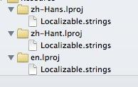
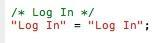
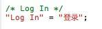

# iOS 国际化及获取当前设置语言

#### (一)iOS国际化和genstrings所有子目录本地化字符串

首先，我们使用字符串，必须用`NSLocalizedString(key,comment)`，这样我们在不同的`Localizable.strings`对key指定不同的值，系统会根据当前系统语言，去不同的`lproj`找不同的字符串。用个图显示吧：


我们应用只支持中文，英文，所以只建了`zh-Hans.lproj`和`en.lproj`，然后在`Localizable.strings`指定了不同的值。举例如下：




这样程序就能根据系统语言，去选择“登录”还是“Log In”。

但是如果每次加了一个本地化字符串，就得手动去`Localizable.strings`添加对应的key，那就太麻烦了，幸好苹果提供了快捷生成本地化key的命令。下面以`en.lproj`的生成为例：

首先，我们进入程序工程所在的目录，用命令建立`en.lproj`

`mkdir en.lproj`

然后我们遍历所有的子目录文件，去生成`Localizable.strings`，命令如下：

`find ./ -name *.m -print0 | xargs -0 genstrings -o en.lproj`

（基本都说`genstrings -o en.lproj *.m`就可以生成`Localizable.strings`，但是这个命令只能生成当前目录的，并没有遍历子目录，所以基本没用）

这样系统就会把子目录用到`NSLocalizedString`函数的key值都写到文件里。

需要注意的是，`NSLocalizedString(key,comment)`，用这个函数时，key不能是宏定义或者一些动态字符串，否则用上面的命令会报错

主要步骤：

1. 在代码里用`NSLocalizedString`获取要本地化的字符串
2. 用`genstrings`扫描代码文件，生成`Localizable.strings`，然后加到工程中

#### (二)如何获取当前设置的语言

```
NSUserDefaults *defaults = [NSUserDefaults standardUserDefaults];
NSArray *languages = [defaults objectForKey:@"AppleLanguages"];
NSString *currentLanguage = [languages objectAtIndex:0];
```

取得设置好的语言。日语是ja，中文是zh_Hans ,英文是en …

```
NSArray *Localizations = [[NSBundle mainBundle] preferredLocalizations];
```

